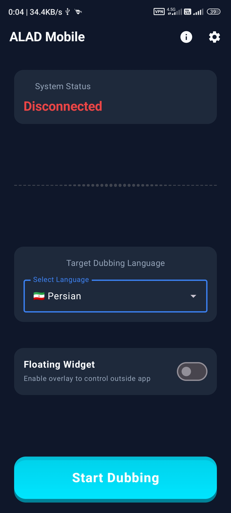
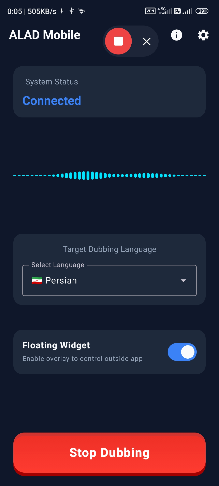
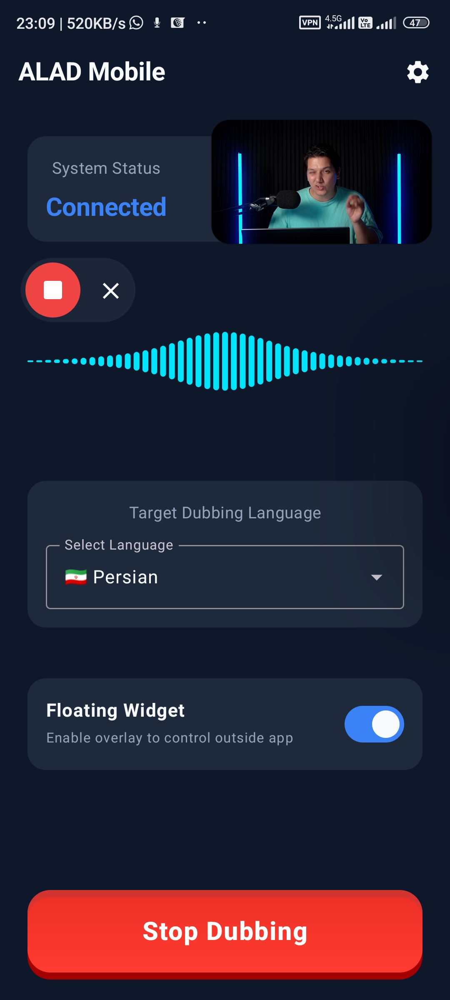
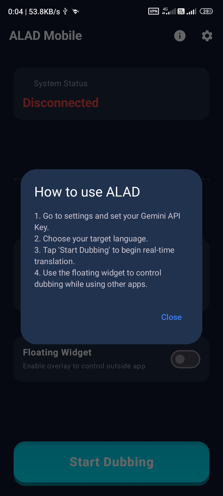
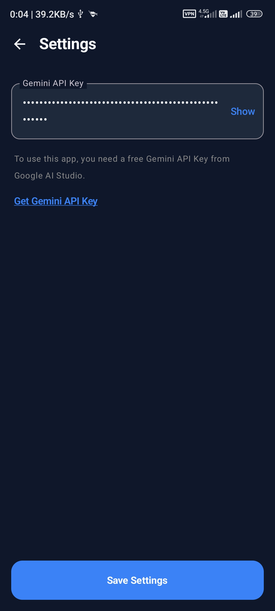

  🌐 <strong>Read in English</strong> | <a href="README-fa.md">خواندن به زبان فارسی</a>

  

<h1>🎙️ ALAD — AI Live Audio Dubbing (Mobile)</h1>

<strong>Real-time AI voice dubbing for any Android app, powered by Google's Gemini 3.5 Live Translate.</strong>

  
  
  
  
  
  

  <b>Watch any video or listen to any podcast. Hear it in your language — instantly.</b> 
  No subscriptions. No accounts. 100% free and open-source.

 

---

## 🌍 What is ALAD Mobile?

**ALAD (AI Live Audio Dubbing)** is a native Android application that breaks the language barrier on your smartphone. It works silently in the background — capturing the internal system audio from your active apps (like YouTube, Spotify, or Netflix), sending it to Google's cutting-edge **Gemini 3.5 Live Translate** model over a persistent WebSocket connection, and playing back the translated voice in real-time.

Unlike traditional captioning or subtitle tools, ALAD produces **live spoken audio dubbing** — you *hear* the translation, not just read it.

> **Use case examples:**
> - 🎬 Watch a Korean drama on your phone without subtitles and hear it in English
> - 📰 Listen to a German news podcast on Spotify dubbed live in Arabic  
> - 🎓 Follow a Japanese lecture in Persian in real-time  
> - 🎮 Watch foreign streamers on Twitch Mobile and understand every word

---

## 🎬 Screenshots & Demo

  
  
  
  
  

 

**Watch the Demo Video:**

  <video src="[https://github.com/navidseyedain/ALAD-Mobile/raw/main/docs/Screenrecorder-ALADMobile.mp4](https://github.com/user-attachments/assets/d84752e5-3f69-4930-9b5b-a8e7c54ae9e1)" controls="controls" width="100%" height="auto">
    Your browser does not support the video tag.
    <a href="[https://github.com/navidseyedain/ALAD-Mobile/raw/main/docs/Screenrecorder-ALADMobile.mp4](https://github.com/user-attachments/assets/d84752e5-3f69-4930-9b5b-a8e7c54ae9e1)">Download the video here</a>
  </video>

---

## ✨ Features

### 🎙️ Core: Live AI Dubbing
- **Real-time bidirectional streaming:** Ultra-low latency connection to the Gemini API via WebSocket.
- **Internal Audio Capture:** Uses Android's MediaProjection API to capture crisp system audio without external background noise.
- **Smart Audio Ducking:** Automatically lowers the volume of the original media (like a YouTube video) while dubbing is active, so you can clearly hear the translated voice.
- **Persistent Background Service:** Allows ALAD to dub continuously even if you switch apps or lock your screen.

### 🎛️ Floating Widget Controller
- **Seamless Multitasking:** Control the dubbing (start/stop) directly from a floating widget that hovers over your active apps. No need to switch back and forth.
- **Live Visualizer:** The floating widget features a real-time waveform that pulses with the audio frequency, giving you visual feedback that translation is actively working.

### 🌐 Universal App Compatibility
Not limited to one app. If the app plays audio on your phone and allows internal capture — **ALAD can dub it**.

### 🏗️ Modern Android Architecture
- **100% Kotlin**
- **Jetpack Compose** for a beautiful, reactive, and dark-themed UI
- **Clean Architecture** (Core, Data, Presentation layers)
- **Coroutines & Flows** for asynchronous data streaming

---

## 🗺️ 78 Languages Supported

| | | | |
|---|---|---|---|
| 🇿🇦 Afrikaans | 🇪🇹 Amharic | 🇸🇦 Arabic | 🇦🇲 Armenian |
| 🇦🇿 Azerbaijani | 🇧🇩 Bengali | 🇧🇬 Bulgarian | 🇲🇲 Burmese |
| 🇨🇳 Chinese (Simplified) | 🇹🇼 Chinese (Traditional) | 🇭🇷 Croatian | 🇨🇿 Czech |
| 🇩🇰 Danish | 🇳🇱 Dutch | 🇺🇸 English | 🇪🇪 Estonian |
| 🇵🇭 Filipino | 🇫🇮 Finnish | 🇫🇷 French | 🇬🇪 Georgian |
| 🇩🇪 German | 🇬🇷 Greek | 🇮🇳 Gujarati | 🇳🇬 Hausa |
| 🇮🇱 Hebrew | 🇮🇳 Hindi | 🇭🇺 Hungarian | 🇮🇸 Icelandic |
| 🇮🇩 Indonesian | 🇮🇹 Italian | 🇯🇵 Japanese | 🇮🇳 Kannada |
| 🇰🇿 Kazakh | 🇰🇭 Khmer | 🇷🇼 Kinyarwanda | 🇰🇷 Korean |
| 🇱🇦 Lao | 🇱🇻 Latvian | 🇱🇹 Lithuanian | 🇲🇰 Macedonian |
| 🇲🇾 Malay | 🇮🇳 Malayalam | 🇮🇳 Marathi | 🇲🇳 Mongolian |
| 🇳🇵 Nepali | 🇳🇴 Norwegian | 🇮🇷 Persian | 🇵🇱 Polish |
| 🇧🇷 Portuguese (Brazil) | 🇵🇹 Portuguese (Portugal) | 🇮🇳 Punjabi | 🇷🇴 Romanian |
| 🇷🇺 Russian | 🇷🇸 Serbian | 🇮🇳 Sindhi | 🇱🇰 Sinhala |
| 🇸🇰 Slovak | 🇸🇮 Slovenian | 🇪🇸 Spanish | 🇰🇪 Swahili |
| 🇸🇪 Swedish | 🇮🇳 Tamil | 🇮🇳 Telugu | 🇹🇭 Thai |
| 🇹🇷 Turkish | 🇺🇦 Ukrainian | 🇵🇰 Urdu | 🇺🇿 Uzbek |
| 🇻🇳 Vietnamese | 🇿🇦 Zulu | | |

---

## 🚀 How to Setup & Run

### Prerequisites
1. **Android Device:** Must be running Android 10.0 (API 29) or higher to support Internal Audio Capture.
2. **Gemini API Key:** You need a free API key from [Google AI Studio](https://aistudio.google.com/).

### Installation
1. Go to the [Releases](https://github.com/navidseyedain/alad-mobile/releases) page.
2. Download the latest `app-debug.apk`.
3. Install the APK on your Android device.

### Build from Source
1. Clone the repository: `git clone https://github.com/navidseyedain/alad-mobile.git`
2. Open the project in **Android Studio**.
3. Let Gradle sync the project.
4. Click **Run** to build and install on your connected device.

---

## 🔒 Privacy & Security

- **Direct Connection:** The app connects *directly* from your phone to Google's Gemini API via WebSocket. There is no middleman server.
- **Local Storage:** Your API key and preferences are stored securely and locally on your device using Android DataStore.

---

## 📜 License

This project is licensed under the MIT License - see the [LICENSE](LICENSE) file for details.
